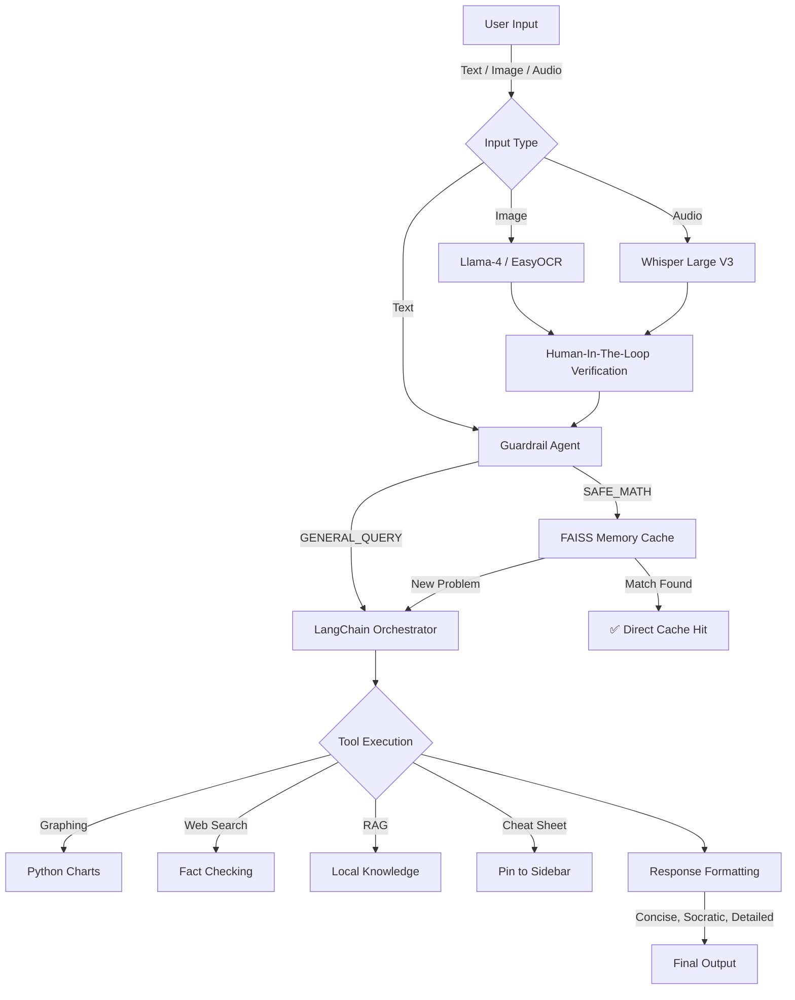

# 🎓 Intelligent Chatbot & Math Mentor

**Streamlit Cloud Link:** [https://multimodal-math-mentor-erfwdtdnygvpixfmd5qpdt.streamlit.app/](https://multimodal-math-mentor-erfwdtdnygvpixfmd5qpdt.streamlit.app/)

An advanced, multimodal AI tutoring system and general-purpose chatbot. Designed to help students master complex mathematical concepts and answer general queries using real-time web search and dynamic graphing capabilities.


---

## 🚀 Overview

**Math Mentor & Chatbot AI** goes beyond traditional conversational agents. It functions as a complete **learning dashboard**, featuring adaptive response modes, interactive mathematical graphing, local memory caching, and self-building cheat sheets. 

It handles multimodal inputs—allowing you to snap pictures of handwritten math problems or simply speak to it—and verifies your input using a Human-In-The-Loop (HITL) pipeline to ensure perfect accuracy.

---

## 🏗️ System Architecture


```mermaid
graph TD
    User[User Input] -->|Text / Image / Audio| Router{Input Type}
    
    Router -->|Image| Vision[Llama-4 / EasyOCR]
    Router -->|Audio| Audio[Whisper Large V3]
    Router -->|Text| Guardrail[Guardrail Agent]
    
    Vision --> HITL[Human-In-The-Loop Verification]
    Audio --> HITL
    HITL --> Guardrail
    
    Guardrail -->|SAFE_MATH| Memory[FAISS Memory Cache]
    Guardrail -->|GENERAL_QUERY| Agent[LangChain Orchestrator]
    
    Memory -->|Match Found| Recall[✅ Direct Cache Hit]
    Memory -->|New Problem| Agent
    
    Agent --> Tools{Tool Execution}
    Tools -->|Graphing| Matplotlib[Python Charts]
    Tools -->|Web Search| DuckDuckGo[Fact Checking]
    Tools -->|RAG| LocalDB[Local Knowledge]
    Tools -->|Cheat Sheet| UI_Pin[Pin to Sidebar]
    
    Tools --> Formatter[Response Formatting]
    Formatter -->|Concise, Socratic, Detailed| UI[Final Output]
```

---

## ✨ Core Features

### 🧠 Adaptive Response Modes
- **Detailed:** Provides in-depth, step-by-step explanations, evaluates web results for confidence, and proactively pins formulas to your cheat sheet.
- **Concise:** Skips the fluff and delivers direct answers and final equations.
- **Socratic (Mentorship):** Refuses to just "give you the answer." Instead, it guides you by asking probing pedagogical questions to help you solve the problem yourself.

### 📈 Interactive Graphing Engine
Ask it to "Visualize `np.sin(x)`" or "Plot `x^2 - 4`," and the AI will dynamically write and execute Python Matplotlib code in the background, rendering a perfectly scaled graph directly in your chat history.

### 📝 Dynamic Cheat Sheet
As the AI tutor explains key theorems or formulas (like the Quadratic Formula or Pythagorean Theorem), it proactively uses an internal tool to "pin" these equations to your sidebar dashboard, building a personalized quick-reference guide during your session.

### 💾 Local Semantic Memory (FAISS)
If you solve a problem and mark it as **"✅ Accurate"**, the query and solution are instantly vectorized via HuggingFace `all-MiniLM-L6-v2` and saved to a local FAISS database. If you (or another student) ask a similar question later, the system perfectly retrieves the cached answer in 0.1 seconds, bypassing the LLM generation entirely.

### 🛡️ AI Guardrails & Safety
Every input is screened by an instantaneous Llama-3.1-8b guardrail that classifies the intent as `SAFE_MATH`, `GENERAL_QUERY`, or `UNSAFE`. This ensures the specific Math UI components (like the Verification buttons) only appear when appropriate.

### 📄 Session-to-PDF Export
At the end of a tutoring session, simply click the "Export Session to PDF" button to convert your entire history into a beautifully formatted, downloadable `.pdf` study guide.

---

## 🛠️ Technology Stack

- **Frontend Interface:** Streamlit (Custom Dark/Green Enterprise Theme)
- **AI Orchestration:** LangChain (Tool Calling Agents)
- **Primary LLM:** Groq `llama-3.3-70b-versatile` (Fast, high IQ tool usage)
- **Guardrail LLM:** Groq `llama-3.1-8b-instant` (Low latency routing)
- **Vector Database:** FAISS
- **Embeddings:** HuggingFace `all-MiniLM-L6-v2`
- **Vision/Audio:** EasyOCR, Llama-4-Vision, Whisper-v3
- **Graphing Module:** Matplotlib, Numpy

---

## 📂 Project Structure

```text
math-mentor/
├── app.py                      # Main Streamlit Application & UI logic
├── models/
│   ├── embeddings.py           # HuggingFace FAISS embeddings setup
│   └── llm.py                  # Groq LLM initialization
├── utils/
│   ├── agent_utils.py          # Core LangChain Agent & Tool definitions
│   ├── guardrail_utils.py      # Pre-flight query classification
│   ├── helper_utils.py         # Image (OCR) and Audio parsing logic
│   ├── memory_utils.py         # FAISS read/write and Vector caching
│   ├── pdf_utils.py            # FPDF2 Chat history exporter
│   ├── rag_utils.py            # Document retrieval context
│   └── search_utils.py         # Web Search API integration
├── data/                       # Local storage (Memory JSON & FAISS Index)
├── generated_graphs/           # Temporary storage for dynamic UI plots
├── exports/                    # Output directory for Session PDFs
├── requirements.txt            # Python dependencies
└── config/
    └── config.py               # Environment variable handlers
```

---

## ⚙️ Installation & Setup

1. **Clone the repository:**
   ```bash
   git clone https://github.com/your-username/math-mentor.git
   cd math-mentor
   ```

2. **Create / Activate a Virtual Environment:**
   ```bash
   python -m venv venv
   source venv/bin/activate  # (Mac/Linux)
   # venv\Scripts\activate   # (Windows)
   ```

3. **Install Dependencies:**
   ```bash
   pip install -r requirements.txt
   ```

4. **Set Up API Keys:**
   Create a `.env` file in the root directory and add your Groq API Key:
   ```env
   GROQ_API_KEY=your_groq_api_key_here
   ```

5. **Run the Application locally:**
   ```bash
   streamlit run app.py
   ```
