# 🎓 Multimodal Math Mentor Pro

**An Advanced Agentic AI Tutor for STEM Education**


## � Overview

**Math Mentor Pro** is a cutting-edge, multimodal AI tutoring system designed to help students master complex mathematical concepts (Algebra, Calculus, Linear Algebra, Probability). Unlike standard chatbots, it functions as a **System of Agents** that "think," "critique," and "remember."

It mimics a human tutor's workflow:
1.  **Sees** the problem (Computer Vision).
2.  **Hears** the question (Audio Transcription).
3.  **Parses** the intent (Structured Extraction).
4.  **Recalls** similar past problems (Vector Memory).
5.  **Solves** it step-by-step (Logic Engine).
6.  **Verifies** its own work (Auto-Critique).

---

## 🏗️ System Architecture

The application is built on a **Multi-Agent RAG (Retrieval-Augmented Generation)** architecture.

```mermaid
graph TD
    User[User Input] -->|Text / Image / Audio| Router{Input Type}
    
    Router -->|Image| Vision[Llama-4 Scout / OCR]
    Router -->|Audio| Audio[Whisper Large V3]
    Router -->|Text| Guardrail[Guardrail Agent]
    
    Vision --> Guardrail
    Audio --> Guardrail
    
    Guardrail -->|Safe| Parser[Parser Agent]
    Guardrail -->|Unsafe| Block[❌ Block Request]
    
    Parser -->|Structured JSON| Memory{Check Memory?}
    
    Memory -->|Found Similar| Retrieve[✅ Return Cached Solution]
    
    Memory -->|New Problem| Solver[Solver Agent]
    Solver -->|Draft Solution| Evaluator[Evaluator/Critic Agent]
    
    Evaluator -->|Approved| UI[Final Output]
    UI -->|User Feedback| VectorStore[FAISS Database]
```



---

## 🧠 The Agentic Brain

We utilize a **Hybrid Model Strategy** to balance intelligence, speed, and cost.

### 1. **Visual Cortex (Vision Agent)**
-   **Model**: `meta-llama/llama-4-scout-17b` (Preview)
-   **Role**: Acts as a "Dumb Scanner."
-   **Logic**: Strictly instructed to **transcribe only**. It does *not* solve the problem—it simply digitizes handwriting into text/LaTeX for the downstream agents.
-   **Fallback**: Automatically degrades to `EasyOCR` if the API fails.

### 2. **Parser Agent**
-   **Model**: `llama-3.1-8b-instant`
-   **Role**: Structured Data Extraction.
-   **Function**: Converts raw user chaos ("help me solve this calc prob") into structured JSON:
    ```json
    {
      "topic": "Calculus",
      "problem_text": "Integrate x^2",
      "variables": ["x"],
      "needs_clarification": false
    }
    ```

### 3. **Solver Agent ( The Tutor )**
-   **Model**: `llama-3.1-8b-instant` (Optimized for Speed)
-   **Role**: Step-by-Step Reasoning.
-   **Behavior**:
    -   Retrieves formula context from the Knowledge Base (RAG).
    -   Uses a strict **Didactic Framework**: "Understanding -> Key Info -> Formula -> Calculation -> Conclusion."
    -   **Output**: Plain Text (readable `3/8` fractions), avoiding complex LaTeX that confuses beginners.

### 4. **Evaluator Agent ( The Critic )**
-   **Model**: `llama-3.1-8b-instant`
-   **Role**: Quality Assurance.
-   **Function**: Reviews the Solver's draft before showing it to the user. If confidence is low (<80%), it flags the answer.
-   **Robustness**: Includes `Graceful Failure` handling—if Rate Limits are hit, it skips verification rather than crashing the app.

---

## ⚡ Key Features

### 👁️ Multimodal Inputs
-   **Snap & Solve**: Upload an image of a handwritten equation. The system uses HITL (Human-in-the-Loop) to let you verify the scan before solving.
-   **Speak & Solve**: Record your question audibly. The `Whisper-v3` model transcribes it instantly.

### 💾 Long-Term Memory (RAG + FAISS)
-   **Learning**: When you mark an answer as "✅ Accurate," it is vectorized and saved to a local FAISS index.
-   **Recall**: Before solving a new problem, the system performs a **Similarity Search**. If a semantically similar question exists (score < 0.3), it instantly recalls the proven solution, saving compute and ensuring consistency.

### 🛡️ Guardrails
-   **Safety**: Pre-screening logic prevents the system from answering non-math queries (e.g., "How to make a bomb").

---

## 🛠️ Technical Implementation Details

### Tech Stack
-   **Orchestration**: LangChain (Chains, Runnables, Agents).
-   **LLM Provider**: Groq (LPU Inference for sub-second latency).
-   **Vector Store**: FAISS (Local dense vector search).
-   **Frontend**: Streamlit (Python-native UI).
-   **Embeddings**: `HuggingFace / all-MiniLM-L6-v2`.

### Formatting Standards
The system enforces **Plain Text Math** for maximum accessibility:
-   **Fractions**: `3/8` (Not `\frac{3}{8}`)
-   **Power**: `x^2`
-   **Multiplication**: `*` or `x`

---

## � Installation & Setup

### Prerequisites
-   Python 3.10+
-   A [Groq API Key](https://console.groq.com)

### 1. Clone & Install
```bash
git clone https://github.com/your-repo/math-mentor.git
cd math-mentor
python3 -m venv venv
source venv/bin/activate
pip install -r requirements.txt
```

### 2. Configure Environment
Create a `.env` file in the root directory:
```bash
GROQ_API_KEY=gsk_your_key_here
```

### 3. Run the Application
```bash
streamlit run app.py
```

---

## ⚠️ Troubleshooting

**"Rate Limit Exceeded"**
-   The system automatically handles this by downgrading strictly to `8b-instant` models and skipping the optional "Evaluator" step. You will see a warning, but the app will **not** crash.

**"Vision Error"**
-   If the `Llama-4` model is updated/moved, the system will print a "Vision API failed" message and strictly use `EasyOCR` instead. Ensure your image is clear and well-lit.

---

**Developed with ❤️ by Kiran.**
